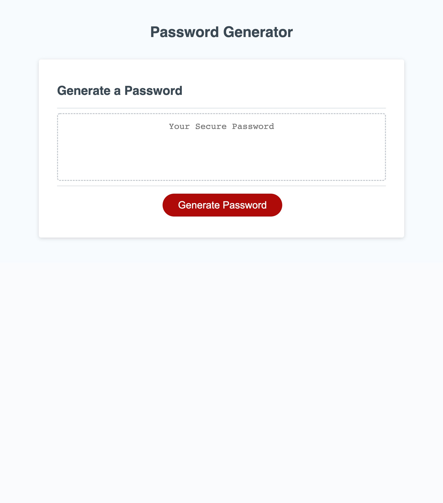

# Password Generator

## Description

This assignment requires the modification of starter code to create a password generator while utilizing JavaScript. The goal is to use alert prompts to define the type and lenght of the password desired, then generate a random password for the user. The length of the password must be between 8 and 128 characters with the option to have lowercase letters, uppercase letters, numbers, and special characters. This assignment requires an understanding of functions, "if" statements, methods, and arrays.  

## Mock-Up

The following image shows the web application's appearance and functionality:

## Application link

https://thaling11.github.io/password-generator/
